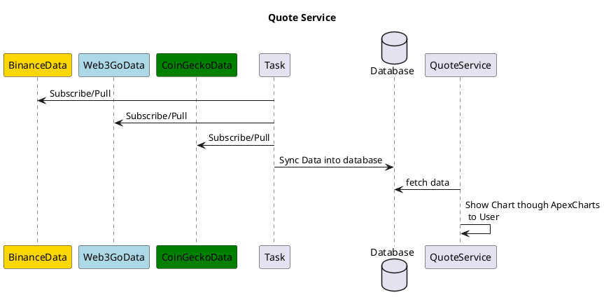
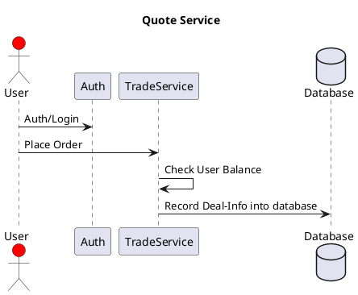
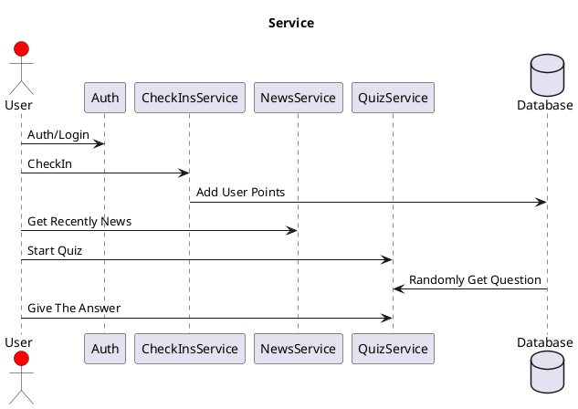
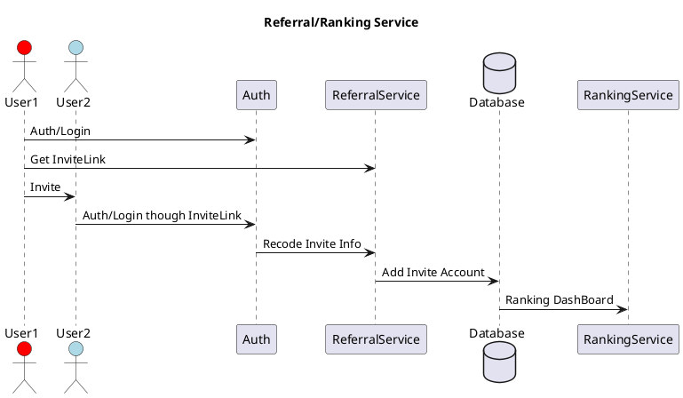
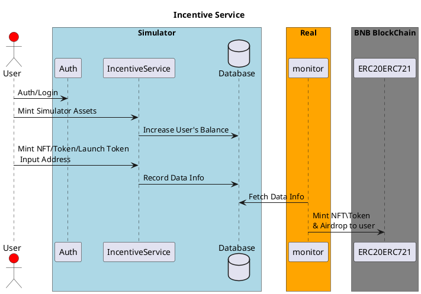

# CryptoTrade Simulator System Design

[TOC]

## Background

数字货币交易模拟器，旨在使用真实的数字货币实时数据模拟交易所，让用户可以使用模拟数字资产进行 Token 的交易，不会损失真钱，并且可以体验数字货币的资产交易过程。

## Purpose

该模拟器旨在吸引 web2 用户体验数字货币的交易流程，使用平台的模拟资产进行买卖数字货币，对用户进行数字货币，区块链技术知识的输入，以及体验数字货币交易的流程，将 web2 的用户引入 web3，扩大用户群体，本文档主要对模拟器的系统设计以及模块的划分进行阐述，指导开发人员进行项目的开发。

## System Design

### Architecture Analysis

根据项目的目标来分析，本项目需要的功能包括：

- 用户授权登录项目
- 向登录的用户进行科普 web3 知识，包含(区块链知识，交易知识，公链知识，账户体系，各种交易类型，交易所的种类....)
- 增加用户粘性，引导用户经常登录，签到系统，问答系统等
- 接入数字货币行情数据，展示给用户各种图表
- 支持多种交易方式，现货/合约/网格/...等待
- 开放接口，支持用户程序接入，进行量化交易
- 排名系统，增加用户可玩性，获取激励
- 拉新模式，通过组队 PK，社交分享，拉新得激励，扩大产品用户数量
- 荣誉和成就系统，引入真实的 NFT/SBT 合约，用户在达成里程碑时，系统引导用户注册钱包，空投 NFT/SBT 给用户，将用户引入真实交易。
- 通过 FT/NFT/SBT/交易体验等，促使用户创建钱包去交易所进行真实交易

### Architecture Diagram

根据上面的项目功能分析，初步的架构设计图：

- Architecture Diagram
  

### Modules

根据上面的架构图，本项目可以划分为多个模块：

#### Auth Module

本系统为数字货币交易模拟，初步登录方式定为原生账户密码+第三方授权登录，支持：

- 电子邮件地址/密码
- Google 账户
- Github 账户
- Twitter 账户
  等账户体系登录

**技术选型**
采用 Google Firebase。
Firebase 是一套全面的工具和服务，作为 Backend-as-a-Service（BaaS）平台提供，使开发人员能够轻松创建、启动和扩展移动和网络应用。它提供了一个实时数据库、认证、存储、托管和更多的功能，并且全部由一个平台管理。为开发者提供了许多选项，能够创建功能强大、多样的 web、 Android 和 iOS 平台应用程序，为开发者解决三个主要问题:

- 快速开发应用
- 充满信心地发布和监控应用程序
- 吸引用户

Google Firebase 平台的一些突出特性包括数据库、身份验证、推送消息、分析、文件存储等，Firebase 被不同平台的许多流行的应用程序所采用，包括 WhatsApp/Snapchat/Airbnb/Uber/Instagram/Twitter/...，目前是全球开发者所依赖的顶级应用开发平台之一。

#### Quote Module

行情模块，主要是拉取/订阅第三方数字货币的实时行情数据，图表化展示在项目中，让用户在实时行情下，分析币价走势，买卖数字货币。

**技术选型**

- 前端框架采用 React
- 采用 Framer Motion 动画渲染
- K 线/分时/图表等采用 ApexCharts

**时序图**

#### Trade Module

交易模块，该项目一直采用的是真实的行情数据，所以本项目并没有撮合系统，没有对手方，直接按当前价格成交，仅仅是记录下用户的买卖单，实时根据价格统计用户的盈亏情况。

**时序图**

#### Check-ins/News/Quiz Module

本模块为互动模块，增强用户粘性，利用激励系统，让用户多使用该 App, 分为 3 个板块：

- 签到模块
  用户每日登录可以获取积分，累计到一定的量可以兑换虚拟资产(NFT/SBT/Token)
- 新闻模块
  本 App 的主要群体为 web2 用户，所以给用户传输相关的知识和新闻是必要的，让用户了解虚拟资产/web3/区块链等相关知识
- 测验模块/问答系统
  增强与用户的互动，让用户参与答题，巩固用户的 web3 知识，并且能获取到奖励(App 的模拟资产/NFT/排行榜等)

**时序图**

#### Referral/Ranking Module

拉新以及排名模块，帮助项目获得更多的用户，提高用户的转化率

- 每个用户都有自己的推荐链接，新用户通过推荐链接进来，会给推荐人增加奖励
- 组队 PK，用户之间可以组队与其他队 PK，根据时间段的收益率排名，排名靠前的获取奖励

**时序图**

#### Incentive Module

激励模块，该模块为重点模块，可以提高产品的用户量，提高转化为真实交易用户的转化率。激励保护：

- 模拟资产的奖励
  用户在平台的模拟资产不是无限的，可以奖励模拟资产让用户继续参与交易以及其他模块
- NFT
  用户达到一定的成就时，填入钱包地址，后台直接空投 NFT 到用户钱包(用户不需要支付 claim 的 gas 费用)，这里指引用户去交易所注册账户或者注册 metamask 账户
- Token
  空投真实的 Token 资产给用户钱包，引导用户注册交易所，参与实盘买卖
- launch Token
  在用户达成一定成就后，可以让用户在平台体验发 token 的过程，并且支持在平台内交易

**时序图**

## Tech stack

根据本系统设计文档，设计到的技术栈包含：

- React Js - Frontend
- Firebase - Authentication
- Supabase - Postgres SQL database
- Framer motion - Animation
- Tailwind CSS - Styling
- Redux Toolkit - State management
- Capacitor - In order to convert the Web App to Android app and deploy it to the Play Store
- Netlify - Hosting
