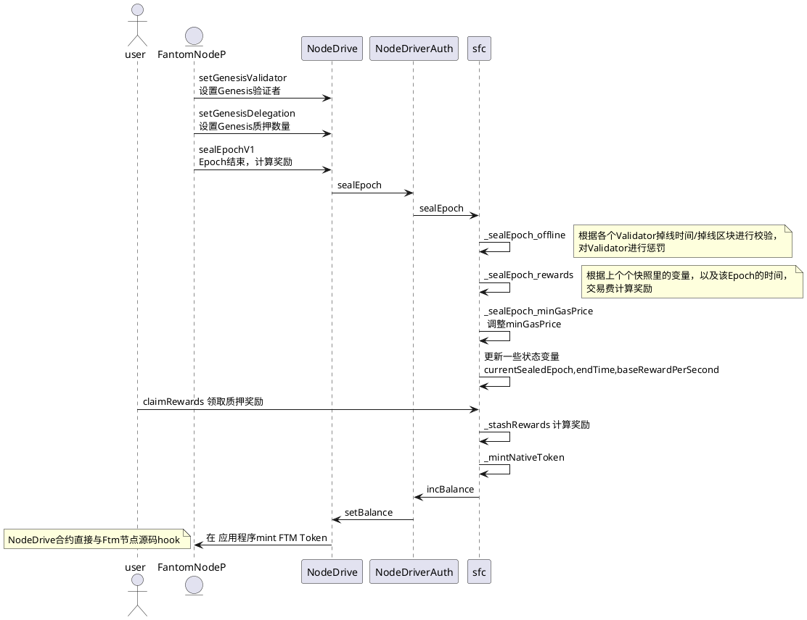

# Fantom经济模型解析

## 1. 发布前融资
种子销售：2018 年 2 月以每个代币 0.016 美元的价格出售了 1 亿个 FTM 代币，共筹集了 160 万美元。
首次私募：2018 年 5 月以每个代币 0.031 美元的价格出售了 8.05 亿个 FTM 代币，共筹集了 2480 万美元。
第二次私募：2018 年 6 月以每个代币 0.035 美元的价格出售了 3.71 亿个代币，共筹集了 1290 万美元。
公开发售（ICO）：2018 年 6 月以每个代币 0.04 美元的价格出售了 5000 万个代币，共筹集了 265 万美元。
总供应量：3,175,000,000
预挖奖励和空投：32.75%
创始人和项目：25.49%
投资者：41.76%

## 2. 经济激励机制/分配方法
### 2.1. 节点奖励比重计算方法
validator的奖励由2个独立的数字加权：交易奖励权重和基础奖励权重。
* transactions reward weight：
验证者将在epoch结束时收到的交易费用份额。
* base reward weight：
验证者将在epoch结束时收到的基本奖励（新铸造token）的份额。

* 公式计算：
    * transactions reward weight = originated fee * uptime
    * base reward weight = stake * (uptime ^ 2)

其中：
* stake: 总质押数
* uptime: 整个epoch期间节点在线的纳秒数
* originated fee: 节点在epoch期间处理的总交易的费用

originated fee可以粗略地估计为：
* stake share * uptime * network fee per nanosecond
代入公式，可以得到:
* transactions reward weight = (stake share * uptime * network fee per nanosecond)*uptime

### 2.2. 节点奖励构成
* transactions reward 交易费
整个epoch消耗的交易费用，会发送到SFC合约，30%燃烧掉，剩余的70%根据#2.1节的各节点比重分配给validator.
* Base rewards 基础奖励
Base rewards = epoch duration in second * base reward per second. 
Base reward per second 由SFC合约配置，各节点具体可得根据#2.1节的各节点比重分配

* 委托人的奖励要分出固定的15%给validator

## 3. Fantom SFC系列合约解析
### 3.1. 合约文件架构
ConstansManaget 合约：一些系统参数变量的记录
GasPriceConstants 合约：Gas动态的调整
NetworkInitialzer 合约：初始化各合约的关系以及配置
NodeDriver 合约： 与节点挂钩，仅支持节点调用
NodeDriverAuth 合约：配合SFC和NodeDriver，对两边的状态进行修改，函数只允许对应的合约调用
SFC 合约：Token合约，对奖励的分配以及原生代币的操作

### 3.2. ConstansManaget
minSelfStake：成为validator最小抵押量
maxDelegatedRatio：最多能接受多少倍的委托量
validatorCommission：收取委托人收益的费率
burntFeeShare：燃烧手续费用的百分比
treasuryFeeShare：放入金库的百分比(手续费)
unlockedRewardRatio：不锁住的奖励百分比
minLockupDuration：最小质押时间
maxLockupDuration：最大质押时间
withdrawalPeriodEpochs：未委托股权被锁定的时期数
withdrawalPeriodTime：未委托股权被锁定的时间
baseRewardPerSecond：每秒基础奖励
offlinePenaltyThresholdBlocksNum：容许的最大掉块数
offlinePenaltyThresholdTime：容许的最大掉线时间
targetGasPowerPerSecond：每秒最大的gaspower
gasPriceBalancingCounterweight：gasPrice计算权重

### 3.3. NodeDriver合约
```shell
//设置账号的Ftm余额
function setBalance(address acc, uint256 value) external onlyBackend
//升级合约，覆盖原有合约的code
function copyCode(address acc, address from) external onlyBackend
//交换合约地址code
function swapCode(address acc, address with) external onlyBackend
//修改设置合约的存储
function setStorage(address acc, bytes32 key, bytes32 value) external onlyBackend
//修改账号nonce值
function incNonce(address acc, uint256 diff) external onlyBackend
//更新网络规则
function updateNetworkRules(bytes calldata diff) external onlyBackend
//修改validator权重
function updateValidatorWeight(uint256 validatorID, uint256 value) external onlyBackend
//修改validator的pubkey
function updateValidatorPubkey(uint256 validatorID, bytes calldata pubkey) external onlyBackend
```
==========以上接口只允许NodeDriverAuth合约调用============
```shell
//设置Genesis validator
function setGenesisValidator(address _auth, uint256 validatorID, bytes calldata pubkey, uint256 status, uint256 createdEpoch, uint256 createdTime, uint256 deactivatedEpoch, uint256 deactivatedTime) external onlyNode
//设置 Genesis delegator
function setGenesisDelegation(address delegator, uint256 toValidatorID, uint256 stake, uint256 lockedStake, uint256 lockupFromEpoch, uint256 lockupEndTime, uint256 lockupDuration, uint256 earlyUnlockPenalty, uint256 rewards) external onlyNode
//将validator设置为其他状态
function deactivateValidator(uint256 validatorID, uint256 status) external onlyNode
//设置Epoch的ValidatorsID
function sealEpochValidators(uint256[] calldata nextValidatorIDs) external onlyNode
//Epoch结束后进行结算
function sealEpoch(uint256[] calldata offlineTimes, uint256[] calldata offlineBlocks, uint256[] calldata uptimes, uint256[] calldata originatedTxsFee) external onlyNode
//Epoch结束后进行结算V1版本
function sealEpochV1(uint256[] calldata offlineTimes, uint256[] calldata offlineBlocks, uint256[] calldata uptimes, uint256[] calldata originatedTxsFee, uint256 usedGas) external onlyNode
```
==========以上接口只允许Fantom节点源码调用，与源码hook住============

### 3.4. NodeDriverAuth合约
NodeDriverAuth作为SFC合约和NodeDriver合约的桥接，NodeDriver <=> NodeDriverAuth <=> sfc合约。
NodeDriverAuth的接口分为两部分，都做了权限控制。
一部分接口供NodeDriver调用，一部分供SFC调用。

### 3.5. SFC合约
作为管理reward合约，负责激励的铸造/分发/奖惩/配置修改/等功能。
* 状态变量详解
```shell
//Validator 结构体
struct Validator {
    uint256 status;  //Validator状态
    uint256 deactivatedTime; //掉线时间
    uint256 deactivatedEpoch; //掉线的Epoch

    uint256 receivedStake; //总质押数量
    uint256 createdEpoch; //创建时候的Epoch
    uint256 createdTime; //创建时间

    address auth; //创建Validator的地址
}
NodeDriverAuth internal node; //NodeDriverAuth合约地址
struct Rewards {
    uint256 lockupExtraReward; //冻结的额外奖励
    uint256 lockupBaseReward; //冻结的基础奖励
    uint256 unlockedReward; //可提取奖励
}
uint256 public currentSealedEpoch; //已处理的最新Epoch值
mapping(uint256 => Validator) public getValidator; // ValidatorID => Validator
mapping(address => uint256) public getValidatorID; // address => ValidatorID
mapping(uint256 => bytes) public getValidatorPubkey; // ValidatorID => pubkey
uint256 public lastValidatorID; //最新的ValidatorID
uint256 public totalStake;  //总共质押数
uint256 public totalActiveStake; //总共有效的质押数
uint256 public totalSlashedStake; //总共消减的数量
mapping(address => mapping(uint256 => Rewards)) internal _rewardsStash; // 用户在某个ValidatorId的奖励
mapping(address => mapping(uint256 => uint256)) public stashedRewardsUntilEpoch; // 用户在某个ValidatorId到Epoch结束的奖励
struct WithdrawalRequest {
    uint256 epoch;
    uint256 time;
    uint256 amount;
}
mapping(address => mapping(uint256 => mapping(uint256 => WithdrawalRequest))) public getWithdrawalRequest;

struct LockedDelegation {
    uint256 lockedStake; //质押数量
    uint256 fromEpoch; //起始Epoch
    uint256 endTime; //结束时间
    uint256 duration; //质押时长
}
mapping(address => mapping(uint256 => uint256)) public getStake; //用户在某个Validator质押的数量
mapping(address => mapping(uint256 => LockedDelegation)) public getLockupInfo;//用户在某个Validator质押的信息
mapping(address => mapping(uint256 => Rewards)) public getStashedLockupRewards;//用户在某个Validator冻结奖励

struct EpochSnapshot {
    mapping(uint256 => uint256) receivedStake; //Epoch快照Validator质押的数量
    mapping(uint256 => uint256) accumulatedRewardPerToken; //积累的奖励
    mapping(uint256 => uint256) accumulatedUptime; //累计在线时间
    mapping(uint256 => uint256) accumulatedOriginatedTxsFee; //累计交易费
    mapping(uint256 => uint256) offlineTime; //掉线时间
    mapping(uint256 => uint256) offlineBlocks; //掉线区块数量
    uint256[] validatorIDs; //验证者集合
    uint256 endTime; //结束时间
    uint256 epochFee; //Epoch费用
    uint256 totalBaseRewardWeight; //总基础奖励权重
    uint256 totalTxRewardWeight; //总交易奖励权重
    uint256 baseRewardPerSecond; //每秒基础奖励token数量
    uint256 totalStake; //总质押数
    uint256 totalSupply; //总发行数量
}

uint256 private erased0;
uint256 public totalSupply; //总发行数量
mapping(uint256 => EpochSnapshot) public getEpochSnapshot; // Epoch => EpochSnapshot

uint256 private erased1;
uint256 private erased2;

mapping(uint256 => uint256) public slashingRefundRatio; // validator ID -> (slashing refund ratio)
address public stakeTokenizerAddress; //根据质押量mint sFTM的合约地址

uint256 private erased3;
uint256 private erased4;

uint256 public minGasPrice; //最小gasPrice
address public treasuryAddress; //金库地址
address internal libAddress; //SFCLib合约地址
ConstantsManager internal c; //SFC参数配置合约地址
address public voteBookAddress; //治理投票合约地址
```

### 3.6. Reward奖励计算流程
