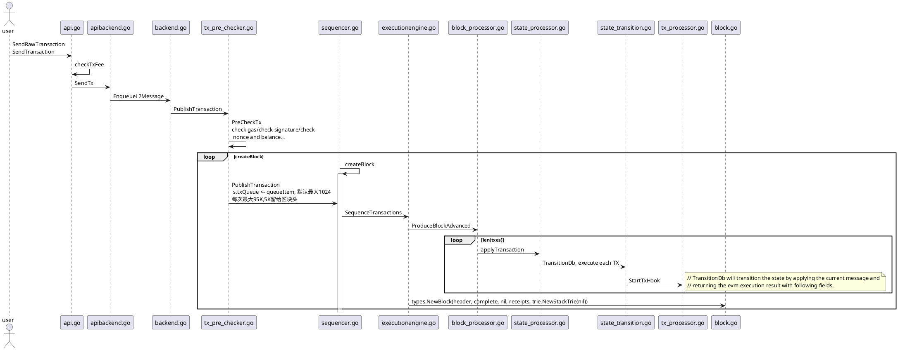
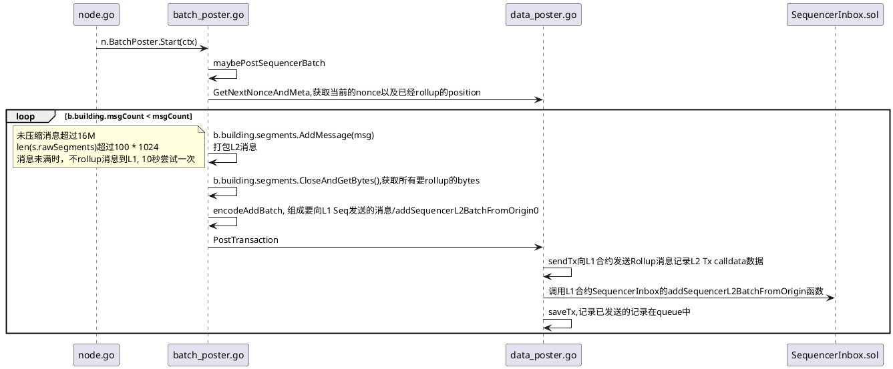
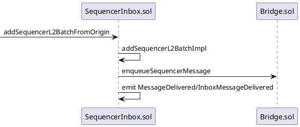
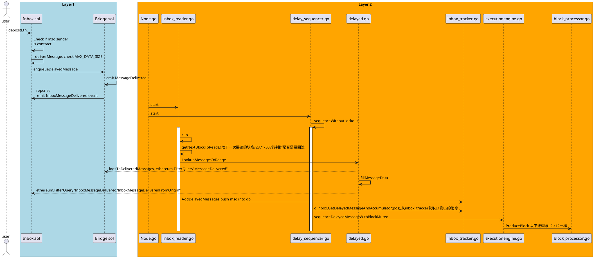
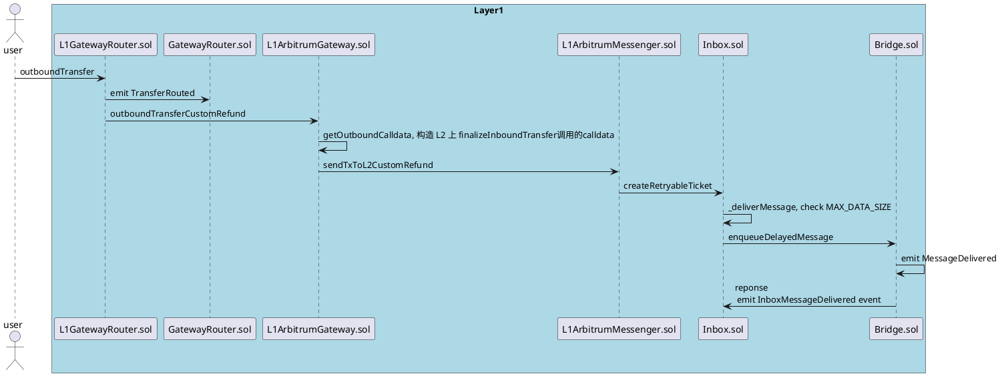
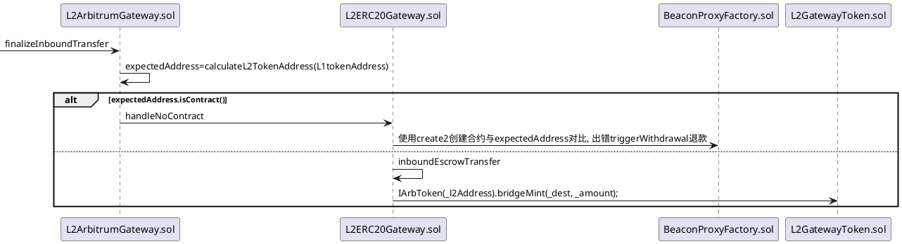
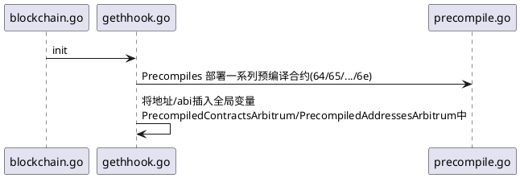
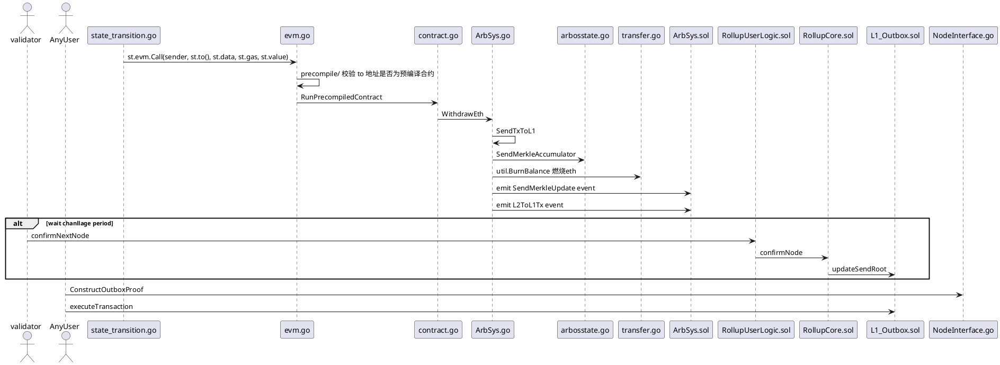
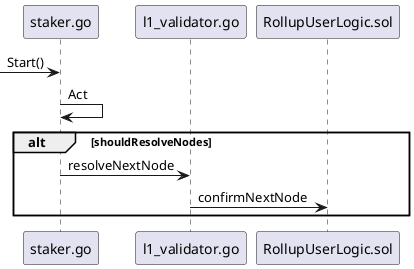

# Arbitrum

## L2 -> L2（TX）

- 时序图



```shell
默认100毫秒执行出块逻辑createBlock

SendRawTransaction 解码为TX时区分普通交易以及 EIP2718 交易

//PreCheckTx时候，用这config.Strictness变量设置检查的严格程度
const TxPreCheckerStrictnessNone uint = 0
const TxPreCheckerStrictnessAlwaysCompatible uint = 10
const TxPreCheckerStrictnessLikelyCompatible uint = 20
const TxPreCheckerStrictnessFullValidation uint = 30

//对交易设置前置条件
type ConditionalOptions struct {
        KnownAccounts  map[common.Address]RootHashOrSlots `json:"knownAccounts"`
        BlockNumberMin *hexutil.Uint64                    `json:"blockNumberMin,omitempty"`
        BlockNumberMax *hexutil.Uint64                    `json:"blockNumberMax,omitempty"`
        TimestampMin   *hexutil.Uint64                    `json:"timestampMin,omitempty"`
        TimestampMax   *hexutil.Uint64                    `json:"timestampMax,omitempty"`
}
```

## L2 Tx Rollup to L1



```shell
func BatchPosterConfigAddOptions(prefix string, f *flag.FlagSet) {
	f.Bool(prefix+".enable", DefaultBatchPosterConfig.Enable, "enable posting batches to l1")
	f.Bool(prefix+".disable-das-fallback-store-data-on-chain", DefaultBatchPosterConfig.DisableDasFallbackStoreDataOnChain, "If unable to batch to DAS, disable fallback storing data on chain")
	f.Int(prefix+".max-size", DefaultBatchPosterConfig.MaxBatchSize, "maximum batch size")
	f.Duration(prefix+".max-delay", DefaultBatchPosterConfig.MaxBatchPostDelay, "maximum batch posting delay")
	f.Bool(prefix+".wait-for-max-delay", DefaultBatchPosterConfig.WaitForMaxBatchPostDelay, "wait for the max batch delay, even if the batch is full")
	f.Duration(prefix+".poll-delay", DefaultBatchPosterConfig.BatchPollDelay, "how long to delay after successfully posting batch")
	f.Duration(prefix+".error-delay", DefaultBatchPosterConfig.PostingErrorDelay, "how long to delay after error posting batch")
	f.Int(prefix+".compression-level", DefaultBatchPosterConfig.CompressionLevel, "batch compression level")
	f.Duration(prefix+".das-retention-period", DefaultBatchPosterConfig.DASRetentionPeriod, "In AnyTrust mode, the period which DASes are requested to retain the stored batches.")
	f.String(prefix+".gas-refunder-address", DefaultBatchPosterConfig.GasRefunderAddress, "The gas refunder contract address (optional)")
	f.Uint64(prefix+".extra-batch-gas", DefaultBatchPosterConfig.ExtraBatchGas, "use this much more gas than estimation says is necessary to post batches")
	f.String(prefix+".redis-url", DefaultBatchPosterConfig.RedisUrl, "if non-empty, the Redis URL to store queued transactions in")
	RedisLockConfigAddOptions(prefix+".redis-lock", f)
	dataposter.DataPosterConfigAddOptions(prefix+".data-poster", f)
}
MaxBatchSize:                       100000, //最大rollup交易的size
BatchPollDelay:                     time.Second * 10, //默认间隔秒数
PostingErrorDelay:                  time.Second * 10, //默认出错的时候下个间隔秒数
MaxBatchPostDelay:                  time.Hour,        //最大间隔秒数 1小时

type DataPosterConfig struct {
	RedisSigner            signature.SimpleHmacConfig `koanf:"redis-signer"`
	ReplacementTimes       string                     `koanf:"replacement-times"`
	WaitForL1Finality      bool                       `koanf:"wait-for-l1-finality" reload:"hot"`
	MaxMempoolTransactions uint64                     `koanf:"max-mempool-transactions" reload:"hot"`
	MaxQueuedTransactions  uint64                     `koanf:"max-queued-transactions" reload:"hot"`
	TargetPriceGwei        float64                    `koanf:"target-price-gwei" reload:"hot"`
	UrgencyGwei            float64                    `koanf:"urgency-gwei" reload:"hot"`
	MinFeeCapGwei          float64                    `koanf:"min-fee-cap-gwei" reload:"hot"`
	MinTipCapGwei          float64                    `koanf:"min-tip-cap-gwei" reload:"hot"`
}
MaxMempoolTransactions  //限制 MempoolTx 长度
MaxQueuedTransactions   //限制BatchPoster QueueTx 长度
```

- L1 合约逻辑



```shell
type BatchPoster struct {
	stopwaiter.StopWaiter
	l1Reader     *headerreader.HeaderReader
	inbox        *InboxTracker
	streamer     *TransactionStreamer
	config       BatchPosterConfigFetcher
	seqInbox     *bridgegen.SequencerInbox
	bridge       *bridgegen.Bridge
	syncMonitor  *SyncMonitor
	seqInboxABI  *abi.ABI
	seqInboxAddr common.Address
	building     *buildingBatch
	daWriter     das.DataAvailabilityServiceWriter
	dataPoster   *dataposter.DataPoster[batchPosterPosition]
	redisLock    *SimpleRedisLock
	firstAccErr  time.Time // first time a continuous missing accumulator occurred
	backlog      uint64    // An estimate of the number of unposted batches
}

默认配置每10秒尝试Batch L2Tx to L1/
- 打包成功则继续下一次
- 失败则等待10秒

打包的L2 Tx 是 L2 -> L2（TX）在 transaction_streamer.go中的WriteMessageFromSequencer函数存入的
```

## L1 -> L2（ETH）

- depositEth

```shell
function depositEth() public
        payable
        whenNotPaused
        onlyAllowed
        returns (uint256)
```

- 时序图



```shell
header_reader.go
HeaderReader.broadcastLoop: 订阅L1区块头,并且给转发给订阅该区块头的其他组件.(possiblyBroadcast)
```

- Arbitrum 协议使用 L2 别名来处理 L1 到 L2 消息，防止跨链攻击。如果我们仅重用与 L2 发送方相同的 L1 地址，则可能会发生此类攻击；即通过在 L1 上从预期的合约地址发送可重试票据，欺骗一个期望从给定合约地址接收调用的 L2 合约。
- Arbitrum 监听 Bridge&Inbox 的两个事件，默认是每 100 个区块归并一次，起始高度从 rollup 部署的高度，监听 2 个事件，结合两者信息解析到 DelayedInboxMessage 对象中。

## L1 -> L2（ERC20）

- depositEth

```shell
function outboundTransfer(
        address _token,
        address _to,
        uint256 _amount,
        uint256 _maxGas,
        uint256 _gasPriceBid,
        bytes calldata _data
    ) public payable override(GatewayRouter, ITokenGateway) returns (bytes memory)

//L2合约地址计算方法
function calculateL2TokenAddress(address l1ERC20) public view override returns (address) {
	bytes32 salt = getSalt(l1ERC20);
	return Create2.computeAddress(salt, cloneableProxyHash, l2BeaconProxyFactory);
}
```

- 时序图



- 其他逻辑与存 Eth 一样，最后执行交易时，调用 L2ArbitrumGateway.sol 合约的 finalizeInboundTransfer 函数,存入相应的 ERC20 token



## L2 -> L1(withdraw)

- precompile L2 预编译合约
  在 geth-hook.go 文件的 init 函数中



- L2 -> L1 (withDraw ETH)
  开始的逻辑与 L2->L2 的流程一样, 调用的是预编译合约 0x64 的 WithdrawEth 函数



- Validator 验证者节点需要质押，来参与 RBlock 的提交



- node 类型

```shell
const (
	// Watchtower: don't do anything on L1, but log if there's a bad assertion
	WatchtowerStrategy StakerStrategy = iota
	// Defensive: stake if there's a bad assertion
	DefensiveStrategy
	// Stake latest: stay staked on the latest node, challenging bad assertions
	StakeLatestStrategy
	// Resolve nodes: stay staked on the latest node and resolve any unconfirmed nodes, challenging bad assertions
	ResolveNodesStrategy
	// Make nodes: continually create new nodes, challenging bad assertions
	MakeNodesStrategy
)
```
