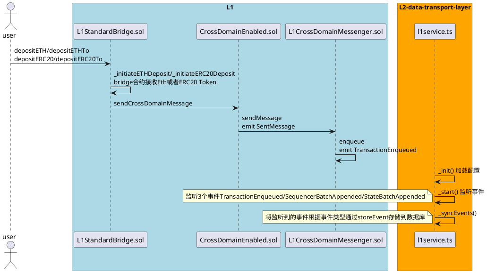
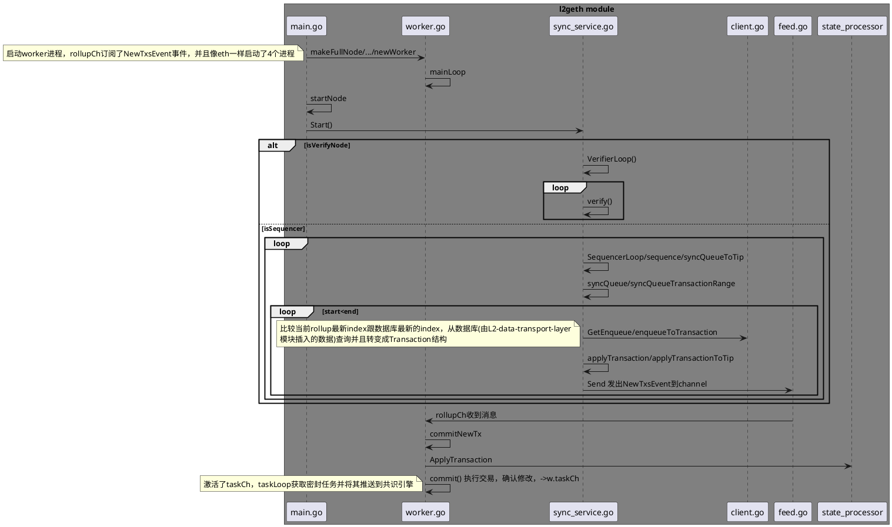
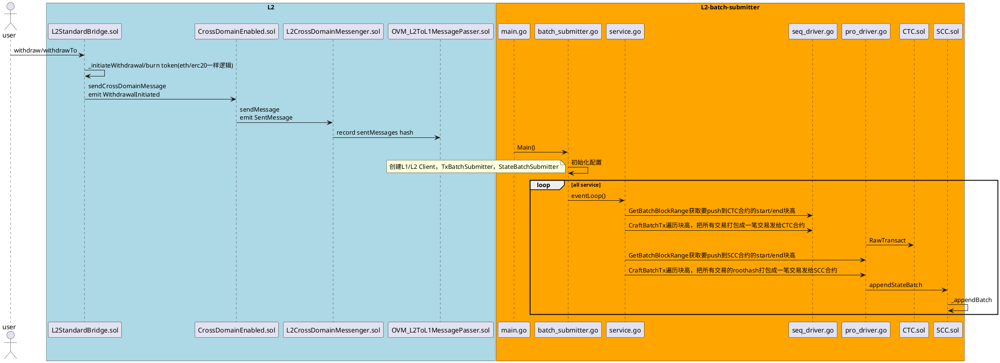
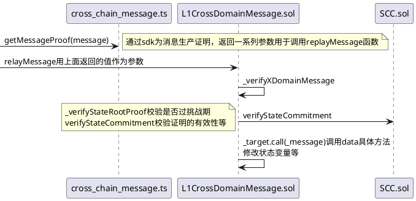

# Optimism 分析

## L1 -> L2 Deposit

- 时序图 1



- **L1 合约解析**

  - depositETH/depositERC20 只允许 EOA 地址调用，不能指定接收地址，想指定地址调用 depositETHTo/depositERC20To
  - sendCrossDomainMessage(l2TokenBridge, l2Gas, message)前，组织 message 字段，调用 l2TokenBridge 合约的 finalizeDeposit 接口

  ```shell
  bytes memory message = abi.encodeWithSelector(
            IL2ERC20Bridge.finalizeDeposit.selector,
            address(0),
            Lib_PredeployAddresses.OVM_ETH,
            _from,
            _to,
            msg.value,
            _data
        );
  ```

  - enqueue(address target, uint256 gasLimit,bytes memory data)前，组织 data 字段，调用 L2CrossDomainMessenger 合约的 relayMessage 接口

  ```shell
  function encodeXDomainCalldata(
        address _target,
        address _sender,
        bytes memory _message,
        uint256 _messageNonce
    ) internal pure returns (bytes memory) {
        return
            abi.encodeWithSignature(
                "relayMessage(address,address,bytes,uint256)",
                _target,
                _sender,
                _message,
                _messageNonce
            );
    }
  ```

  - 合约流 User -> L1StandardBridge -> L1CrossDomainMessenger -> L2CrossDomainMessenger -> L2StandardBridge
  - data 的 size 不能超过 50000
  - 100000 < gaslimit < 15000000
  - 关于 L2 gaslimit, 由于 L1->L2 交易是免 L2 gas 费的，为了防止设置过大的 gaslimit 来阻塞 L2 的运行，CTC 合约做了限制，当 gaslimit 大于 1920000 时，必须要支付额外燃烧的 gas 费

  ```shell
  if (_gasLimit > enqueueL2GasPrepaid) {
        uint256 gasToConsume = (_gasLimit - enqueueL2GasPrepaid) / l2GasDiscountDivisor;
        uint256 startingGas = gasleft();
        require(startingGas > gasToConsume, "Insufficient gas for L2 rate limiting burn.");
        uint256 i;
        while (startingGas - gasleft() < gasToConsume) {
            i++;
        }
    }
  ```

  - queueElements 记录所有的 L1->L2 交易的简介，使用 queueIndex 作为本交易的在 L2 对于交易的 nonce 值

---

- **L2 Data-transport-layer 要点解析**

  - data-transport-layer 组件是由 ts 写的服务，负责监听 L1 合约发出的事件，将其放入数据库
  - 配置要监听的起始 L1 块高，获取当前 L1 最新的确认块高(减去 12,12 个延时最终确认)
  - 遍历两者之间的块高，过滤 3 个事件
    - L1 CTC 合约的 TransactionEnqueued 事件
    - L1 CTC 合约的 SequencerBatchAppended 事件
    - L1 SCC 合约的 StateBatchAppended 事件
  - 解码事件成结构体，调用对应文件的 storeEvent 将数据存入数据库，并且更新最新同步的块高

---

- **时序图 2**
  syncQueueTransactionRange



- **l2geth module 解析**
  - Sequencer 默认 15 秒从数据库拉取 L1->L2 的数据
  - Sequencer 从 data-transport-layer 查询 TransactionEnqueued 事件，转为交易并执行，挖出对应区块
  - L1 过来的交易转化为 L2 交易时，to, gasLimit, data 设置为 L1 调用的对应字段，value, gasPrice 设置为 0，nonce 设置为 queueIndex，v, r, s 未设置
  - 因此 L1->L2 交易 From 的 nonce 可能不连续，跳过 nonce 检查，rsv 未设置，From 设置为 L1MessageSender
  - 因为 L2 免 gas 费，gaslimit 可以随便设置，为了防止攻击，所以在 L1 上对 gaslimit 过大做了 gas 燃烧的机制

---

## L2 -> L1 Withdraw

- 时序图



- **l2geth module 解析**

  - L2 withdraw 到 L1 与 L1->L2 逻辑大体一致，data 为调用 L1StandardBridge.sol 的 finalizeETHWithdrawal 或者 finalizeERC20Withdrawal 函数
  - 打包 root 到 SCC 合约有最小数量限制 MinStateRootElements
  - 打包 tx 到 CTC 合约有配置交易的限制 MinTxSize MaxTxSize
  - 打包的 sender 必须在 BondManager isCollateralized 有质押的，目前合约写的必须 OVM_Proposer 地址
  - appendBatch 将多笔 stateRoot 组织成一棵 Merkle Tree，得到根哈希 batchRoot，组织 meta 信息，得到 batchHeader 存储 batchHeader 到数组 (可以通过 batchIndex 进行索引)

---

- 时序图 relayer



relayer 用于测试，生产需要自己用 sdk 嵌入到产品，由用户或者项目方来支付 L1 的 gas 费用

---

## Withdraw 提款 Proof 证明产生过程

- L2CrossDomainMessenger sendMessage 函数记录要在 L1 调用数据的 hash 值
  ```shell
  function encodeXDomainCalldata(
        address _target,
        address _sender,
        bytes memory _message,
        uint256 _messageNonce
    ) internal pure returns (bytes memory) {
        return
            abi.encodeWithSignature(
                "relayMessage(address,address,bytes,uint256)",
                _target,
                _sender,
                _message,
                _messageNonce
            );
    }
    OVM_L2ToL1MessagePasser记录了_message+msg.sender的hash值
    sentMessages[keccak256(abi.encodePacked(_message, msg.sender))] = true;
  ```
- batch-submitter 进程由两个 driver 服务，sequencer-driver/proposera-driver, 对应 appendSequencerBatch 和 appendStateBatch 函数推送到 L1 的 CTC 和 SCC 合约
- CTC 合约 appendSequencerBatch 根据 calldata 的组织规则(https://community.optimism.io/docs/protocol/compressed-ctc/#initial-solution)解析calldata，nextQueueIndex记录已经成功从L1->L2的交易
- SCC 合约 appendStateBatch 根据传来的块高的 stateRoot 数组，计算 MerkleRoot, 计算 batchheadhahs/ExtraData,push 到 Buffer 结构体
  ```shell
  Lib_OVMCodec.ChainBatchHeader memory batchHeader = Lib_OVMCodec.ChainBatchHeader({
      batchIndex: getTotalBatches(),
      batchRoot: Lib_MerkleTree.getMerkleRoot(_batch),
      batchSize: _batch.length,
      prevTotalElements: totalElements,
      extraData: _extraData
  });
  ```
- Buffer 结构体解析
  ```shell
  struct Buffer {
    bytes32 context;
    mapping(uint256 => bytes32) buf;
  }
  buf字段，key(uint256) 为length长度，value(bytes32)代表传进来数据的hash值
  context: bytes32(最右5个字节代表目前记录的长度,可作为setbuf时的key，左边27个字节存储的是extradata(是totalElements和lastSequencerTimestamp编码组成))
  ```
- sdk 中 cross-chain-messager.ts 的 getMessageProof 获取提款交易的 proof 证明
  - 只为 L2->L1 的交易产生证明
  - getMessageStateRoot 根据消息遍历事件，查询了 SCC 合约的 StateBatchAppended 事件，拿到对应本消息的 stateroot
    ```shell
    emit StateBatchAppended(
        batchHeader.batchIndex,
        batchHeader.batchRoot,
        batchHeader.batchSize,
        batchHeader.prevTotalElements,
        batchHeader.extraData
    );
    return {
        stateRoot: stateRootBatch.stateRoots[indexInBatch],
        stateRootIndexInBatch: indexInBatch,
        batch: stateRootBatch,
      }
    ```
  - makeStateTrieProof(调用 eth_getProof)构建 L2 特定块高的 Slot 的 proof 证明, 对应的 slot 可计算(本文档 241 行):
    ```shell
    const messageSlot = ethers.utils.keccak256(
      ethers.utils.keccak256(
        encodeCrossDomainMessageV0(
          resolved.target,
          resolved.sender,
          resolved.message,
          resolved.messageNonce
        ) + remove0x(this.contracts.l2.L2CrossDomainMessenger.address)
      ) + '00'.repeat(32)
    )
    ```
  - 最后产生可调用 L1CrossDomainMessenger.sol relayMessage 的证明
    ```shell
    return {
      stateRoot: stateRoot.stateRoot,
      stateRootBatchHeader: stateRoot.batch.header,
      stateRootProof: {
        index: stateRoot.stateRootIndexInBatch,
        siblings: makeMerkleTreeProof(
          stateRoot.batch.stateRoots,
          stateRoot.stateRootIndexInBatch
        ),
      },
      stateTrieWitness: toHexString(rlp.encode(stateTrieProof.accountProof)),
      storageTrieWitness: toHexString(rlp.encode(stateTrieProof.storageProof)),
    }
    ```
- L1CrossDomainMessenger.sol 合约 \_verifyStateRootProof 校验提款交易已过挑战期限，并且提交的 proof 是正确的,\_verifyStorageProof 验证关于 OVM_L2ToL1MessagePasser 的 slot 证明是有效的
- 通过 2 个交易，记录成功的提款交易，执行提款操作

## 总结

Op 的机制让用户将资产放到 layer2 进行交易，交易的数据打包到 eth 合约内，并且发布状态根到 eth，欺诈证明目前不可用.
