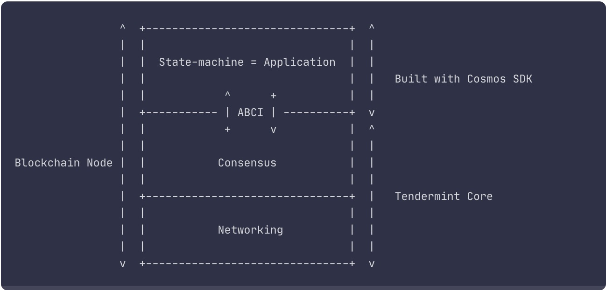

# Cosmos SDK AND Rollkit

[TOC]

## Cosmos SDK

- Cosmos SDK 应用链架构

- 共识
  采用 Tendermint 共识，每个节点对等权利，BFT 类算法，能抵抗 1/3 恶意节点
- 应用链基于 Cosmos SDK 搭建，模块化组件，方便用户搭建 application-specific blockchain
- Tendermint Core 通过 ABCI 接口协议于应用链通信

---

- 模块架构图
