# 模块化区块链笔记

## Cosmos 笔记

### AppChain architecture

Cosmos 架构

- TerdenmintCore 负责共识和 P2P 模块
- AppChain 模块通过 Cosmod SDK 构建 APPChain Layer，通过 ABCI 与 TerdenmintCore 交互，业务逻辑 APPChain 实现

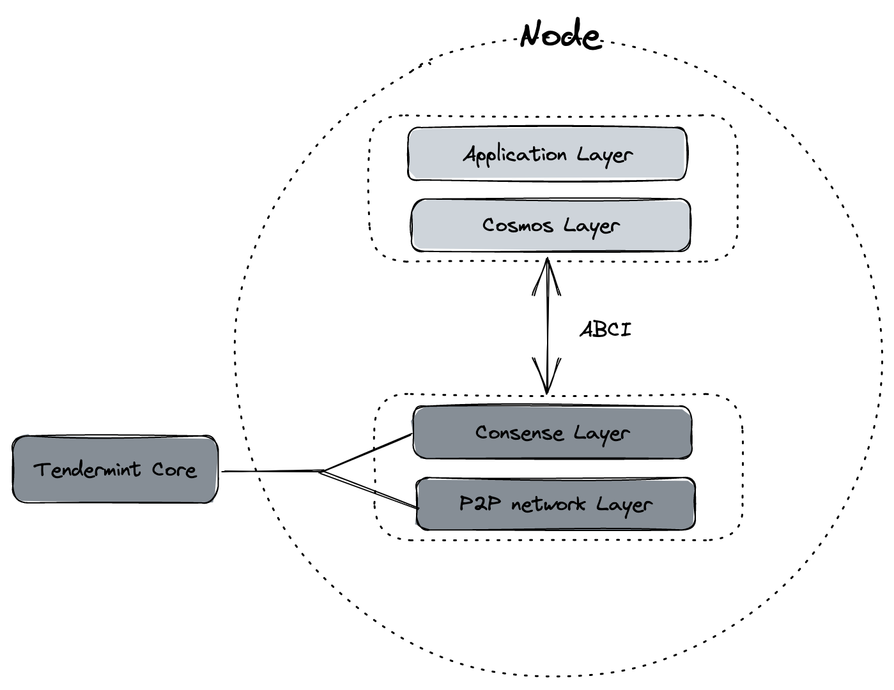

### TX 的生命周期和流程

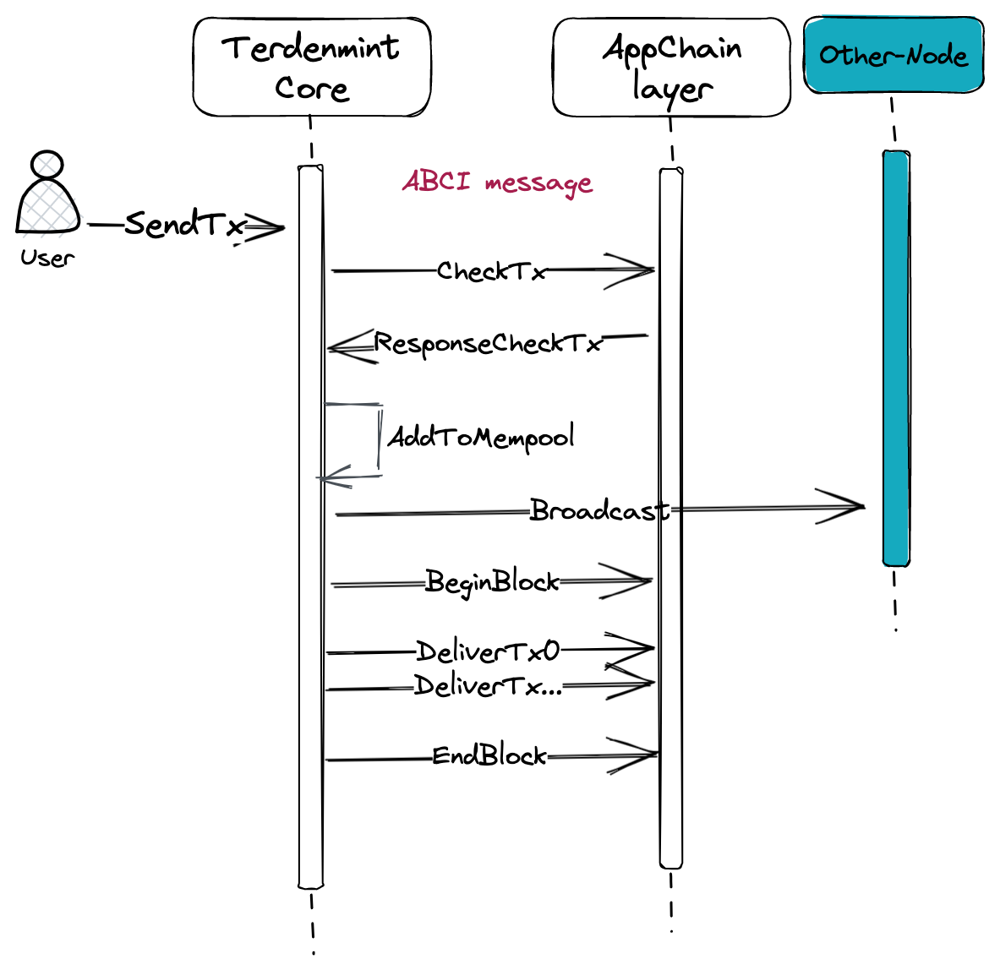

1. TerdenmintCore 接收到用户的交易，通过 ABCI 调用 CheckTX，校验交易合法性
2. 不合法直接丢弃，合法放入 mempool，并且广播给 peer 节点
3. 由出块者从交易池根据规则收录交易打包
4. 通过 ABCI 调用 BeginBlock，标志区块开始
5. 通过 ABCI 将打包的交易发送到 Appchain layer 进行执行，失败所有状态回滚
6. 执行完毕后，通过 ABCI，调用 EndBlock 标志区块结束

### 从交易流程分析 Cosmos 源码

- CheckTx 实现了 ABCI 接口并在 CheckTx 模式下执行交易。在 CheckTx 模式下，消息不会被执行。这意味着消息仅被验证，
- 并且只有 AnteHandler 被执行。如果 AnteHandler 通过，则状态将持久化到 BaseApp 的内部 CheckTx 状态中。
- 否则，ResponseCheckTx 将包含相关的错误信息。无论交易执行结果如何，ResponseCheckTx 都将包含相关的 gas 执行上下文信息。

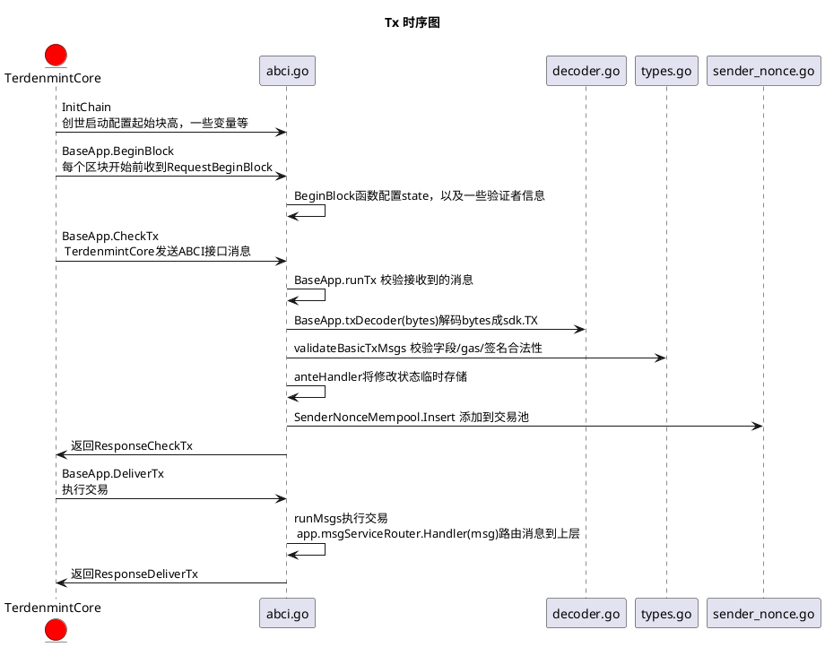

### BeginBlock

- BeginBlock 流程
  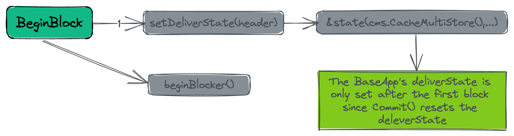

### CheckTx

- CheckTx 流程
  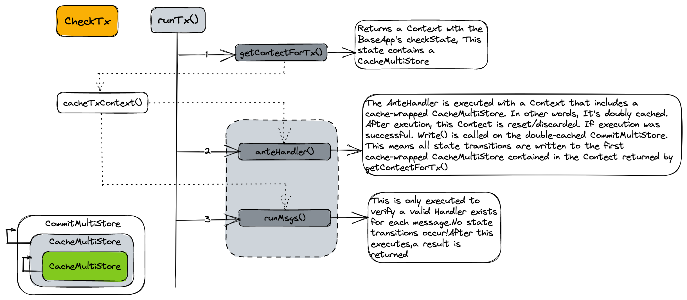

### Commit

- Commit 流程
  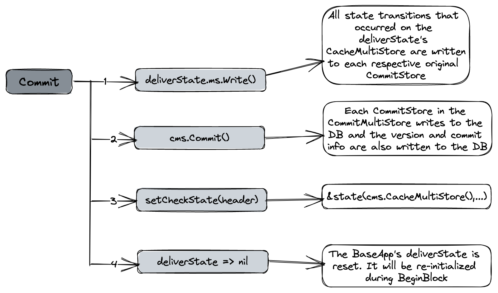

### TxFlow 流过模块

- TxFlow 模块
  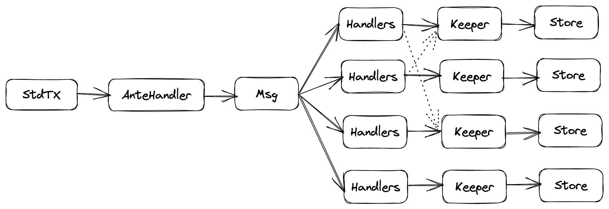

### Application 组成

- customApp.go
  自定义应用程序,是 sdk 中 baseapp 的扩展。当 TerdenmintCore 将交易中继到应用程序时，应用程序使用 baseapp 的方法将其路由到适当的模块。baseapp 实现了大部分应用程序的核心逻辑，包括所有 ABCI 方法和路由逻辑。
- 各模块 Keeper
  每个模块定义了一个抽象 keeper，它处理该模块存储的读写操作。kepper 直接调用要互相授权，每个 keeper 有自己的 store key 去访问自己的存储区
- appCodec
  负责数据的序列号和反序列话，便于数据的存储
- module manager
  模块管理器是一个对象，它包含应用程序模块的列表。方便操作这些模块，例如注册它们的 Msg 服务和 gRPC 查询服务，或为各种功能（如 InitChainer、BeginBlocker 和 EndBlocker）设置模块之间执行顺序。

源码例子：

```go
type SimApp struct {
	*runtime.App                                        //sdk中基础的app结构
	legacyAmino       *codec.LegacyAmino
	appCodec          codec.Codec                       //编解码结构
	txConfig          client.TxConfig                   //txConfig配置
	interfaceRegistry codectypes.InterfaceRegistry

	// keepers
	AccountKeeper         authkeeper.AccountKeeper      //各模块的Kepper，Keeper中包含了store key
	BankKeeper            bankkeeper.Keeper
	CapabilityKeeper      *capabilitykeeper.Keeper
	StakingKeeper         *stakingkeeper.Keeper
	SlashingKeeper        slashingkeeper.Keeper
	MintKeeper            mintkeeper.Keeper
	DistrKeeper           distrkeeper.Keeper
	GovKeeper             *govkeeper.Keeper
	CrisisKeeper          *crisiskeeper.Keeper
	UpgradeKeeper         *upgradekeeper.Keeper
	ParamsKeeper          paramskeeper.Keeper
	AuthzKeeper           authzkeeper.Keeper
	EvidenceKeeper        evidencekeeper.Keeper
	FeeGrantKeeper        feegrantkeeper.Keeper
	GroupKeeper           groupkeeper.Keeper
	NFTKeeper             nftkeeper.Keeper
	ConsensusParamsKeeper consensuskeeper.Keeper

	// simulation manager
	sm *module.SimulationManager
}
// App 是 BaseApp 和 ModuleManager 的包装器，可以混合使用
// app.go/app 配置方案或直接作为 servertypes.Application 实例。
// 要获取 *App 的实例，必须将 *AppBuilder 作为依赖请求
// 在声明运行时模块和 AppBuilder.Build() 的容器中
// 必须调用方法。
// App 可用于创建混合 app.go 设置，其中包含一些配置
// 使用应用程序配置以声明方式完成，其余部分以旧方式完成。
// 有关此设置的示例，请参阅 simapp/app.go。
type App struct {
	*baseapp.BaseApp

	ModuleManager     *module.Manager
	configurator      module.Configurator
	config            *runtimev1alpha1.Module
	storeKeys         []storetypes.StoreKey
	interfaceRegistry codectypes.InterfaceRegistry
	cdc               codec.Codec
	amino             *codec.LegacyAmino
	basicManager      module.BasicManager
	baseAppOptions    []BaseAppOption
	msgServiceRouter  *baseapp.MsgServiceRouter
	appConfig         *appv1alpha1.Config
	// initChainer is the init chainer function defined by the app config.
	// this is only required if the chain wants to add special InitChainer logic.
	initChainer sdk.InitChainer
}
// BaseApp reflects the ABCI application implementation.
//BaseApp 反映了 ABCI 应用程序的实现
type BaseApp struct { //nolint: maligned
	// initialized on creation
	......
}
```

- 构造函数

```go
func NewSimApp(
  logger log.Logger,
  db dbm.DB,
  traceStore io.Writer,
  loadLatest bool,
  appOpts servertypes.AppOptions,
  baseAppOptions ...func(*baseapp.BaseApp),
) *SimApp
```

构造函数执行的主要操作如下：

- 使用基本管理器实例化一个新编解码器并初始化应用程序模块的每个编解码器。
- 使用引用到 baseapp 实例、编解码器和所有适当的存储键来实例化一个新应用程序。
- 使用每个应用程序模块的 NewKeeper 函数定义，实例化应用程序类型中定义的所有 keeper 对象。请注意，必须按正确顺序实例化 keepers，因为一个模块的 NewKeeper 可能需要对另一个模块的 keeper 进行引用。
- 使用每个应用程序模块的 AppModule 对象来实例化应用程序模块管理器。
- 通过该模块管理器，初始化应用程序消息服务、gRPC 查询服务、传统消息路由和传统查询路由。当 CometBFT 通过 ABCI 将交易中继到该应用时，它会使用此处定义的路由将其路由到相应模块的 Msg 服务。同样地，在收到 gRPC 查询请求时，它会使用此处定义的 gRPC 路由将其路由到相应模块的 gRPC 查询服务上。Cosmos SDK 仍支持传统 Msgs 和传统 CometBFT 查询，并分别使用传统 Msg 路由和传统查询路由进行路由。
- 通过该模块管理器，在变量不变式注册表中注册该应用程序各自所属于各自不变式。不变量是在每个区块结束时计算（例如代币总供给） 的变量。

## Celestia 笔记

### DA Layer Modular Blockchain

Celestia DA 层由一个 PoS 区块链组成。 Celestia 将这个区块链称为 celestia-app，它是一个提供交易以促进 DA 层的应用程序，并使用 Cosmos SDK 构建。

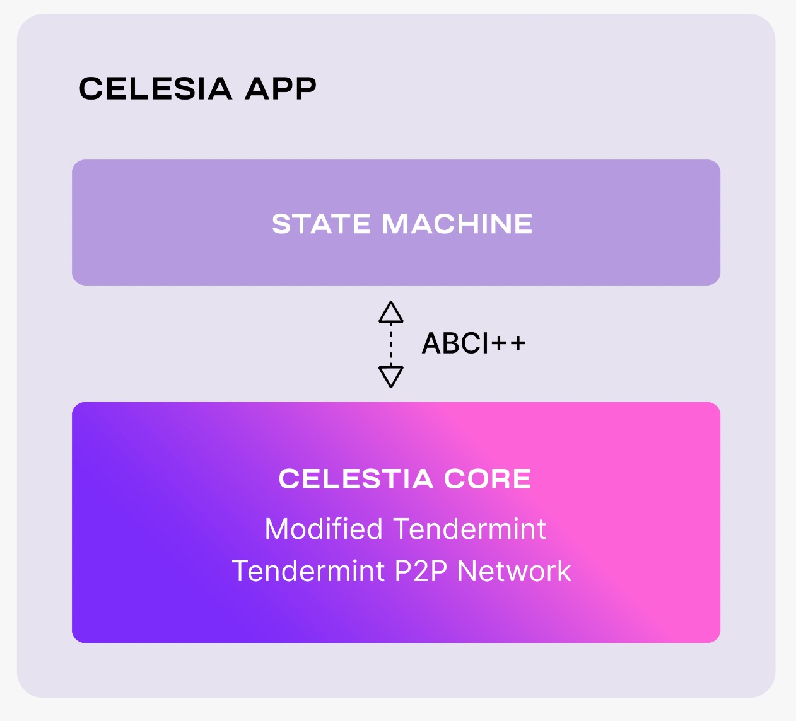

celestia-app 是建立在 celestia-core 之上的，后者是 Tendermint 共识算法的修改版本。改动：

1. 启用块数据的抹除编码（使用二维 Reed-Solomon 编码方案）。
2. 将 Tendermint 用于存储块数据的常规 Merkle 树替换为 Namespaced Merkle 树，从而使上述层（即执行和结算）仅下载所需数据（有关详细信息，请参见下面描述用例的部分）。

### The lifecycle of a celestia-app transaction

类似于 Cosmos SDK：
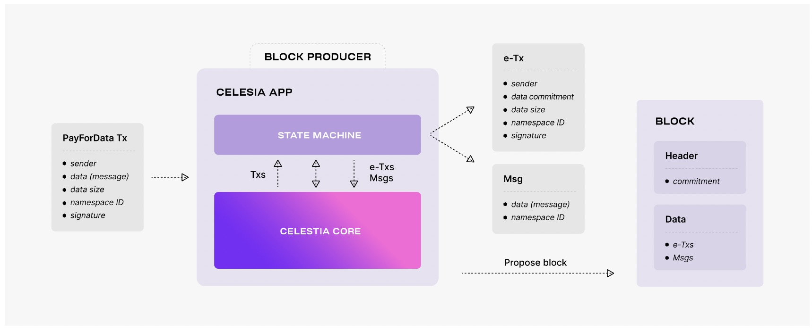

- 用户通过 PayForData 交易将数据交给 Celestia DA 层处理
- Celestia 通过类似 Cosmos ABCI++ABCI++将消息传给 STATE MACHINE 处理，将消息解析为 2 部分：

  ```go
  Msg{
  data(message)
  namespace ID
  }
  e-TX{
  sender
  data commitment
  data size
  namespace ID
  signature
  }
  ```

* 区块生产者将区块数据的承诺添加到区块头中。

### Data availability

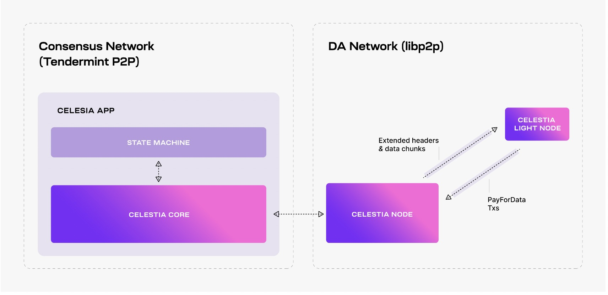
为了增强连接性，celestia-node 通过一个单独的 libp2p 网络（即所谓的 DA 网络）来扩展 celestia-app，以处理 DAS 请求。

- 轻节点监听区块头，可选的对数据进行 DAS 验证
- 轻节点可以发送 PayForData 请求

### 节点类型

- Consensus Network

  - Validator Node
    验证者节点，通过生成和投票区块来参与共识。
  - Consensus Full Node
    全节点，A Celestia-App Full Node 同步区块链历史数据

- Data Availability Network
  - Bridge Node
    桥节点，在 DA 层和共识层桥接区块
  - Full Storage Node
    存储所有数据，但是不连接共识网络
  - Light Node
    轻节点，在 DA 网络通过数据采样验证数据可用性

### 仓库

- https://github.com/celestiaorg/celestia-app
  celestia-app 是应用程序和权益证明逻辑运行的状态机。 celestia-app 基于 Cosmos SDK 构建，还包括 celestia-core，celestia-core 是状态交互、共识和块生产层。 celestia-core 基于 Tendermint Core 构建。
- https://github.com/celestiaorg/celestia-node
  celestia-node 通过单独的 libp2p 网络增强了上述功能，该网络提供数据可用性采样请求。

Celestia-app 仓库 属于 Consensus Network，是运行 Validator Node 和 Consensus Full Node 必须跑的程序，celestia-node 仓库是 Bridge/Light/Full-Storage 节点跑的程序。

## Cosmos 与 Celestia 差异

- Cosmos 利用 Cosmos SDK 搭建了 Cosmos Hub，愿景是让项目方使用 Tendermint + Cosmos SDK 非常方便的搭建链，然后这些 App-chain 与 Cosmos Hub 连接，形成以 CosmoHub 为中心的区块链网络，形成万链互连的局面。本质上 App-chain 是一条完整的独立链，拥有执行层/共识层/网络层/数据存储层，Cosmos 只是提供了一套工具让项目方方便的搭建区块链，并鼓励 App-chain 与 Cosmos Hub 互连
- Celestia 也是利用 Cosmos SDK 搭建了 Celestia-app，形成一个 DA layer 链，通过 DAS(Data availability sampling)与 NMTs(Namespaced Merkle Trees)技术，为基于 Rollkit 工具生成的 Rollup 提供数据服务，Celestia 的愿景是自己基于 Cosmos SDK 搭建链一条链，鼓励项目方使用 Rollkit 工具方便的搭 Rollup，并把 DA 服务委托给 Celestia。

====================

- Cosmos
  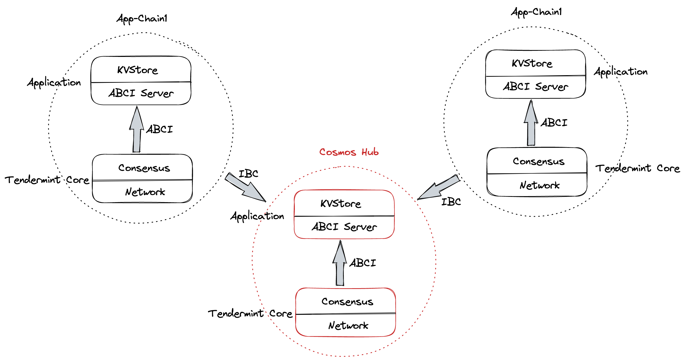

- Celestia
  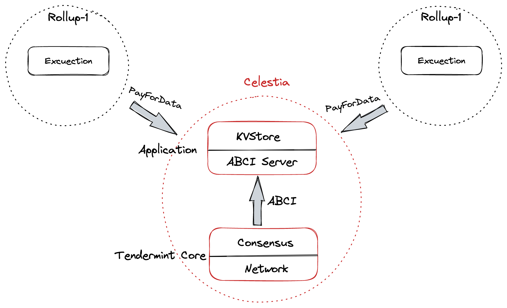
