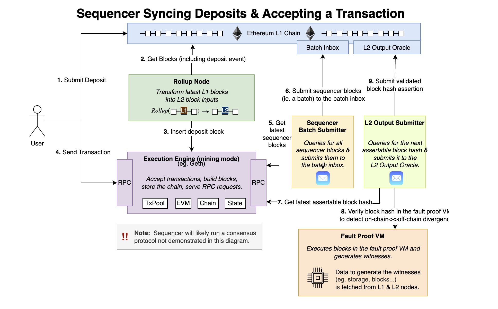
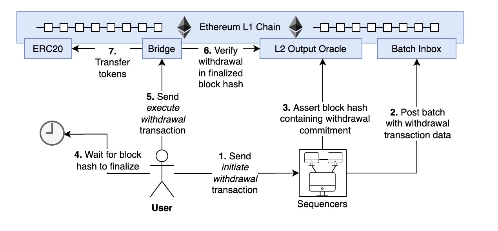

## Optimism

### What's Optimism

Optimism 旨在扩展以太坊，解决以太坊拥堵，费用贵的问题，作为 Eth 的执行层 Rollup，将其他资产跨链到 Optimism 上，进行经济活动，在 Op 上执行交易，将打包后的区块 Data 发布到以太坊上，利用以太坊的共识和安全性，交易在以太坊上不执行，只存储数据和 stateroot。
利用的是乐观 Rollup, Op 跨回 L1 的数据不带 proof，默认认为是正确的数据，所以有个窗口期，防止作恶数据在 L1 上执行，任何人可以发布欺诈证明去覆盖假数据，并赚取奖励。

### Overview

#### Opinion

集权中心化严重

- Relay ETH 合约事件到 OP 中心化
- Sequencers 只有官方运行单独的节点来负责打包出块，可以决定打包的顺序/打包哪些交易/push 哪些数据到 ETH/单机故障等
- OVM2.0 后 欺诈证明目前也不能运行，完全是依赖于项目方的高尚品格
- Slashing 惩罚机制，就算欺诈证明能运行，会不会惩罚官方自己 Sequencers

#### Role

- Users
  - 在 Op 与 Eth 之间转移资产或者发送消息
  - 在 Op 上发送交易
- Sequencers(中心化，只有官方一个节点负责打包出块)
  - 接收 Op 上的交易进行打包出块
  - 监听 Eth 上的交易，主要是 Op 部署的合约事件
  - 将 Op 本地交易以及监听到的跨链交易打包进区块
  - 发布推送 Op 上的区块数据到 Eth(包含交易以及 StateRoot)
- Verifiers
  - 向用户提供数据服务
  - 验证数据的完整性并在发现作恶时发起挑战

---

#### Key Interaction Diagrams

- Depositing and Sending Transactions
  
- Withdrawing
  

### Smart Contract Analysis

Optimism 协议中的智能合约可以分为几个关键组件。

chain：L1 上的合约，它们保存了 L2 交易的排序和相关联的 L2 state root hash。
Verification：L1 上的合约，实现了挑战交易结果的过程。
Bridge：用于在 L1 和 L2 之间传递消息的合约。
Predeploys：一组基本合约，在系统创世状态下已经部署并可用。类似于以太坊的预编译程序，但它们是用 Solidity 编写的，前缀为 0x42 处找到。

#### Chain Contracts

Chain Contracts 是由运行在以太坊主网上的一组合约组成。这些合约存储有序列表，包括：

- 应用于 L2 状态的所有交易的有序列表。
- 每个交易应用后将产生的建议状态根。
- 从 L1 发送到 L2 的待包含在有序列表中的交易。

包含以下主要合约：

- **CanonicalTransactionChain (opens new window)(CTC)**
  Canonical Transaction Chain (CTC) 合约是一个只追加的交易日志合约，必须应用于 OVM 状态。它通过将交易写入 CTC：batches 实例的链存储容器来定义交易排序。CTC 还允许任何账户 enqueue() L2 交易，Sequencer 最终必须将其附加到 Rollup 状态中。
- **StateCommitmentChain (opens new window)(SCC)**
  SCC 合约包含了一份提议的状态根列表，提议者声称这些状态根是规范交易链（CTC）中每个交易的结果。这里的元素与 CTC 中的交易具有 1:1 的对应关系，并且应该是通过逐个应用规范交易离线计算出来的唯一状态根。
- **ChainStorageContainer**
  提供可重复使用的存储，采用“环形缓冲区”数据结构，可以覆盖不再需要的存储槽。部署了三个链式存储容器，其中两个由 CTC 控制，一个由 SCC 控制。
